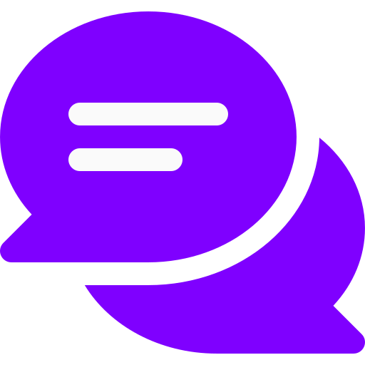

  

# Chatzen - Chat App

Chatzen is a modern and user-friendly chat application project. It provides a simple and intuitive platform for users to connect and engage in conversations with their friends and colleagues.

**Live Demo**: [Chatzen](#)

## Technologies Used

- **React**
- **TypeScript**
- **Redux**
- **Tailwind**
- **JWT**
- **Socket.io**
- **Node.js**
- **Express.js**
- **MongoDB**

## Features

Chatzen offers a range of features to enhance your chat experience:

1. **Real-Time Messaging**: Chat with friends and colleagues in real-time, making conversations feel natural and engaging.

2. **User Authentication**: Secure user authentication ensures that your chats are private and accessible only to the right people.

3. **Private and Group Chats**: Create one-on-one private conversations or group chats, making it easy to communicate with different circles of friends and colleagues.

4. **Multimedia Sharing**: Share text, images, videos, and documents with ease, making your conversations versatile and engaging.

5. **Emojis and Reactions**: Express yourself with emojis and reactions, adding a touch of fun and personalization to your chats.

6. **Search Functionality**: Quickly find specific chats or messages, making it convenient to locate and reference previous conversations.

<!-- 9. **Responsive Design**: ChatZen is designed to work seamlessly on both desktop and mobile devices, ensuring you can chat on the go. -->

<!--
6. **Notification System**: Stay updated with notifications for new messages, ensuring you never miss an important conversation. -->
